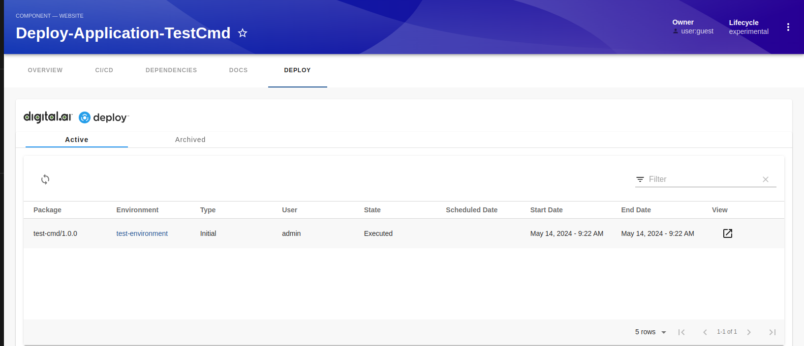

# backstage-workshop

## Setup Digital-ai Deploy [optional]
### 1. Run the following command to run deploy in docker container. [More details on docker images of xl-deploy](https://hub.docker.com/r/xebialabs/xl-deploy)
```shell
docker run -e "ADMIN_PASSWORD=admin" -e "ACCEPT_EULA=Y" -p 4516:4516 --name xld xebialabs/xl-deploy:24.1
```

### 2. Run the following command to create Application, Infrastructure, Environment  and deploy the application in the created Environment using Digital-ai Deploy. 
#### Run the command from the root directory.
```shell
docker pull xebialabs/xl-client:24.1
```
```shell
docker run  -v $(pwd):$(pwd) -w $(pwd) xebialabs/xl-client:24.1 apply -f deploy/deploy-application.yaml --xl-deploy-url http://<deployhost>:4516/ -name xlcli
```
Note: Before Running the above command please update  "http://deployhost:4516/" with actual deploy url.

## Setup backstage using legacy backend system.
#### 1. Run the following command from root directory
```shell
cd backstage-with-legacy-backend
```
#### 2. Configure the deploy instance from previous step or else configure the existing instance by adding the following to your app-config.yaml files.
```yaml
daiDeploy:
  host: http://<deployhost>:4516
  username: 'admin'
  password: 'admin'
```
#### 3. Run the following command to start the backstage app with deploy plugin installed.
```shell
yarn install
```
```shell
yarn dev
```

#### 4. View the Active Deployment in Backstage app.


## Setup backstage using New backend system.
#### 1. Run the following command from root directory
```shell
cd backstage-with-new-backend
```
#### 2. Configure the deploy instance from previous step or else configure the existing instance by adding the following to your app-config.yaml files.
```yaml
daiDeploy:
  host: http://<deployhost>:4516
  username: 'admin'
  password: 'admin'
```
#### 3. Run the following command to start the backstage app with deploy plugin installed.
```shell
yarn install
```
```shell
yarn dev
```

#### 4. View the Active Deployment in Backstage app.


